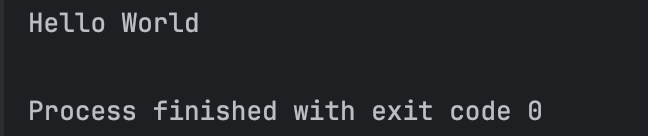

# Тестовый проект для методички

Данный репозиторий создан в учебных целях.  
Он используется для демонстрации работы с Git и GitHub в рамках методических материалов.

---

## Цель проекта

Основные цели:

1. Освоить базовые команды Git  
2. Научиться работать с репозиториями GitHub
3. Отработать загрузку и обновление файлов через терминал  
4. Научиться оформлять свои проекты

---

## Что реализовано

В проекте демонстрируются следующие действия:

- создание репозитория  
- добавление файлов  
- коммиты изменений  
- отправка изменений на GitHub (push)  
- обновление проекта  
- оформление README
---

## Справочные материалы
### Картинка работы программы

### Методичка

[Открыть методичку](https://ссылка-на-диск)